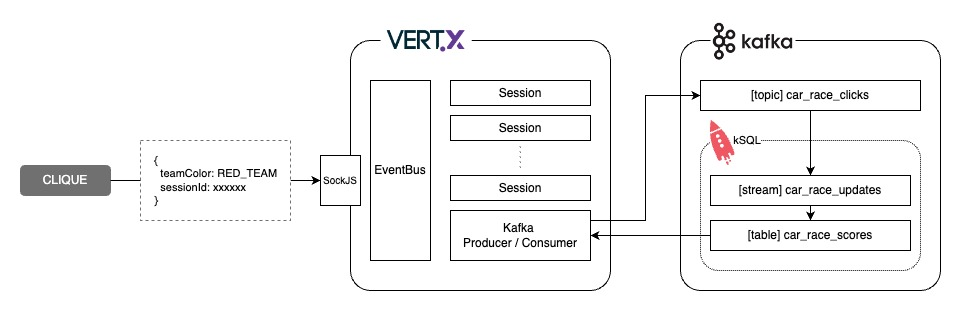

# Cars Race Demo

Developed with Vert.x, Kafka, kSQL and React App.




## kSQL Statements

Create `car_race_updates` stream

```sql
CREATE STREAM car_race_updates (session VARCHAR, team VARCHAR)
  WITH (kafka_topic='cars_race_clicks', value_format='json', partitions=6);
```

Create `car_care_scores` materialized view


```sql
CREATE TABLE car_race_scores WITH (format='json') AS
  SELECT session, team, COUNT(team) as score FROM car_race_updates
  GROUP BY session, team
  EMIT CHANGES;
```

## Running

### React App

```
$ yarn
$ yarn start
```

### Vert.x App

```
$ ./mvnw clean compile exec:java
```